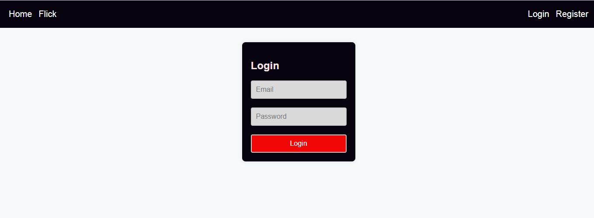
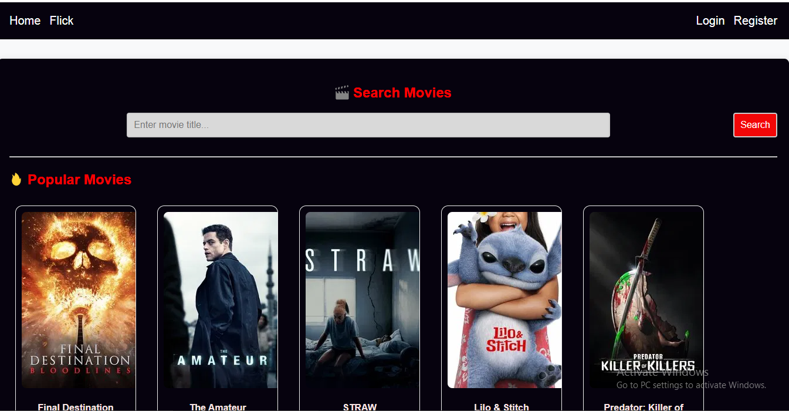

# 🎬 Flick Movie App

Flick is a movie discovery and recommendation platform built with **React**, **Node.js**, **MongoDB**, and **The Movie Database (TMDb)** API. Users can register, log in, and browse or search for their favorite movies, with personalized welcome messages after login.

---

## 🌟 Features

- 🔐 User authentication (register & login with JWT)
- 🧠 Persistent login using `localStorage`
- 🎉 Welcome message with username after login
- 🔍 Search for movies by title
- 🔥 View popular movies fetched from TMDb
- 🖼 Responsive movie card layout
- 💾 Frontend-backend integration

---

## 🛠 Tech Stack

- **Frontend**: React, Axios, React Router
- **Backend**: Node.js, Express, MongoDB, Mongoose, JWT
- **API**: [The Movie Database (TMDb)](https://www.themoviedb.org/)
- **State**: useState, useEffect
- **Styling**: Inline styles / custom CSS (you can switch to Tailwind or Bootstrap)

---

## 🚀 Getting Started

### 📦 Backend Setup

1. **Clone the repo**  
   ```bash

   git clone https://github.com/yourusername/flick-movie-app.git
   cd flick-movie-app/backend

###  Install dependencies

npm install

###  Create .env file

MONGO_URI=your_mongo_connection_string

###  Start the server

npm run dev

## Project Structure

flick-movie-app/
├── backend/
│   ├── models/
│   ├── routes/
│   └── server.js
├── frontend/
│   ├── src/
│   │   ├── pages/
│   │   ├── components/
│   │   └── App.js
│   └── package.json
└── README.md

## Screenshots

### 🔐 Login Page




### 🏠 Home Page 

